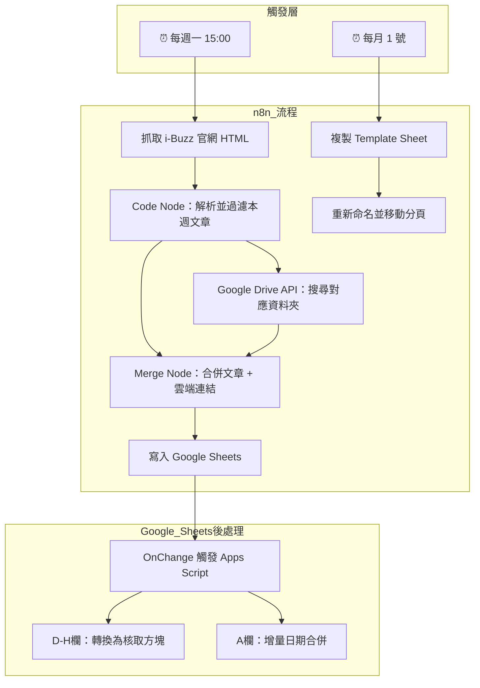
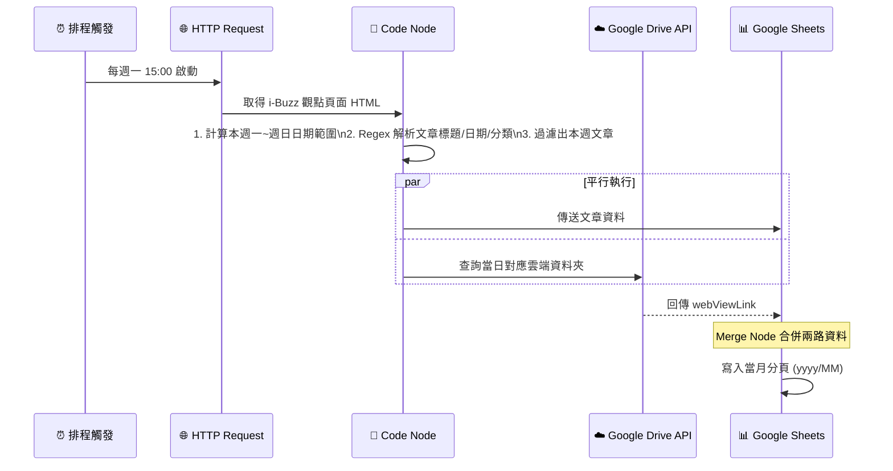
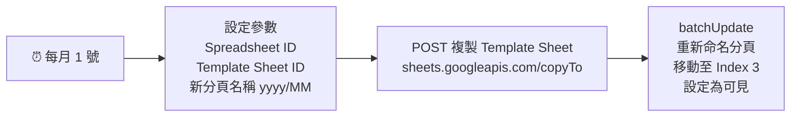
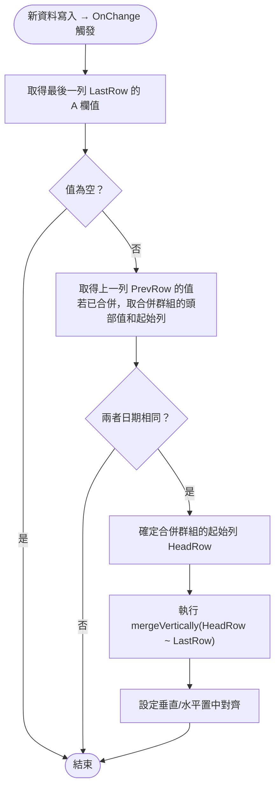

# 自動化系統運作邏輯說明書

**專案名稱**：i-Buzz 文章自動抓取與歸檔系統  
**最後更新**：2026/02/23  
**版本**：v2.0

---

## 一、系統架構總覽

本系統由兩大核心組件組成，各司其職：

| 組件 | 工具 | 執行環境 | 負責工作 |
| :--- | :--- | :--- | :--- |
| **自動化流程** | n8n | 本機 (localhost) | 定時抓取文章、搜尋雲端、寫入試算表 |
| **後處理腳本** | Google Apps Script | Google 雲端 | 自動整理格式（核取方塊、日期合併）|



---

## 二、n8n 工作流程 A：每週文章同步

### 📋 觸發條件

- **時間**：每週一 下午 15:00
- **觸發器類型**：`Schedule Trigger`

### 🔄 執行流程



### 📌 Code Node 核心邏輯

**日期計算（擷取本週一到週日）：**

```javascript
const now = new Date();
const diffToMonday = now.getDay() === 0 ? -6 : 1 - now.getDay();
const mondayDate = new Date(now);
mondayDate.setDate(now.getDate() + diffToMonday);
mondayDate.setHours(0, 0, 0, 0);

const nextMondayDate = new Date(mondayDate);
nextMondayDate.setDate(mondayDate.getDate() + 7);
// 過濾條件：articleDate >= mondayDate && articleDate < nextMondayDate
```

**品牌對應表：**

| 文章分類 | 映射品牌 | Drive 資料夾 |
| :--- | :--- | :--- |
| 消費者洞察 | iBuzz(消費者洞察) | `1tWsHVkYwLBaBAFhAj68K9OntLCCoQAt3` |
| 網紅行銷策略 | Asia KOL | `1CzGWmLOqeCkkjKnuxqVbDJup-PVFfU7H` |
| 數據分析解方 | 業務提供 | `1tWsHVkYwLBaBAFhAj68K9OntLCCoQAt3` |
| 社群粉絲團健檢 | Fans Feed | `1czmLljMgsk1d33fQ_GTzpMl8GBuVsT14` |

---

## 三、n8n 工作流程 B：每月分頁建立

### 📋 觸發條件

- **時間**：每月 1 號
- **觸發器類型**：`Schedule Trigger`

### 🔄 執行流程



**操作的試算表 ID**：`1_srJdmwO8PZtXgbUeZpUWB1T79ubXhXWRZyp2LzvZmo`  
**Template Sheet ID**：`1391772714`

---

## 四、Google Apps Script 後處理邏輯

當 n8n 成功寫入一列新資料後，試算表的 `OnChange` 事件會自動觸發 Apps Script，執行以下兩個功能：

### 功能 1：核取方塊自動轉換

- **範圍**：D 欄至 H 欄（最後 10 列內）
- **邏輯**：若儲存格的值為字串 `"TRUE"` 或 `"FALSE"`，自動套用核取方塊驗證規則並設定勾選狀態。

### 功能 2：A 欄增量日期合併（v17）

這是本系統最核心的演算法，採用**增量合併**策略，只處理最新一筆資料，不動歷史資料。



**關鍵設計決策：**

- 使用 `getDisplayValue()` 做字串比對，避免日期型別問題
- 使用 `getMergedRanges()` 找出既有合併區塊的起始列，確保不斷裂舊合併

---

## 五、資料流向總覽

```
i-Buzz 官網
    │
    │ HTML (每週一)
    ▼
n8n Code Node（解析 + 過濾）
    │
    ├─────────────────────────┐
    │                         │
    ▼                         ▼
Google Drive API          文章資料
（搜尋雲端資料夾）         (標題/日期/品牌/連結)
    │                         │
    └──────┬──────────────────┘
           │ Merge 合併
           ▼
    Google Sheets（寫入當月分頁）
           │
           │ OnChange 觸發
           ▼
    Apps Script
    ├── 核取方塊轉換 (D-H 欄)
    └── 日期合併 (A 欄)
```

---

## 六、常見問題

| 問題 | 原因 | 解法 |
| :--- | :--- | :--- |
| 文章沒被抓到 | 網站改版導致 Regex 失效 | 更新 Code Node 中的 Regex 規則 |
| 日期沒合併 | 日期格式不一致 | 確認 n8n 寫入格式與手動輸入格式相同 |
| 每月沒產生新分頁 | n8n 未保持 Active 或電腦關機 | 確認 n8n 在每月 1 號有在執行 |
| Credential 紅色失效 | 換電腦或 Token 過期 | 重新在 n8n 設定 Google OAuth2 授權 |
